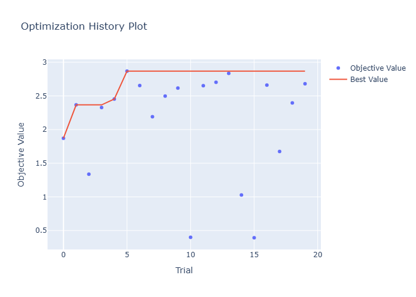
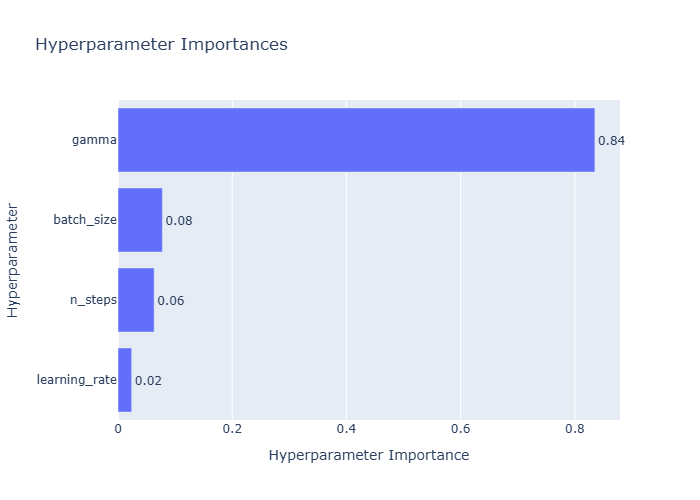

# RockOrRoll — RL Agent for an Auto-Battler Game

## About

RockOrRoll is a simplified Auto-Battler game. An RL agent learns optimal buying and level-up decisions via MaskablePPO to survive as many rounds as possible.

## Project Structure

- `game.py` — Game logic
- `env.py` — Gymnasium environment with Action Masking
- `train.py` — MaskablePPO base training
- `tune.py` — Optuna hyperparameter search
- `eval.py` — Model evaluation

## Setup

```bash
pip install stable-baselines3==2.3.0 sb3-contrib numpy==1.26.4 torch==2.3.0 gymnasium mlflow optuna
```

## Training

```bash
python train.py   # Base model (~100% win_rate)
python tune.py    # Optuna search + best model
python eval.py    # Evaluate best model
```

## MLflow UI

```bash
mlflow ui --backend-store-uri sqlite:///mlflow.db
```

## Key Design Decisions

- Action Masking prevents invalid actions (e.g. rolling without gold, leveling up at max level)
- `board_cost` used as combat value instead of `board_strength`
- Opponent strength calibrated with multiplier 1.5
- Reward: health-based per round + win/loss bonus at the end
- Stage 8 = instant death (10,000 damage)

## Results

### Base Training (`train.py`)

| Metric     | Value |
|------------|-------|
| Win Rate   | 85%   |
| Avg Reward | 3.075 |
| Avg Health | 41.2  |

### Hyperparameter Tuning (`tune.py`)

| Parameter     | Best Value |
|---------------|------------|
| learning_rate | 1.78e-05   |
| n_steps       | 512        |
| batch_size    | 128        |
| gamma         | 0.951      |

### Best Model (`PPO_best`)

| Metric     | Value |
|------------|-------|
| Win Rate   | 100%  |
| Avg Reward | 2.969 |
| Avg Health | 30.0  |




## License

MIT License — see [LICENSE](LICENSE)
